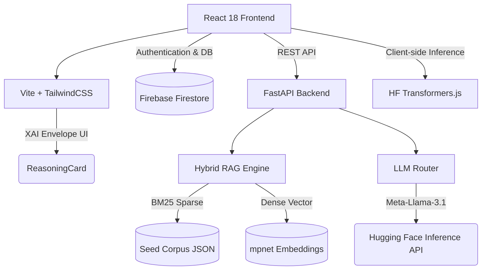

# 🚀 CareerPath: AI-Powered Career Intelligence Platform


**CareerPath** is a state-of-the-art, full-stack career platform designed to empower students and fresh graduates. By leveraging advanced **Retrieval-Augmented Generation (RAG)**, large language models, and deterministic scoring algorithms, CareerPath delivers personalized career roadmaps, real-time interview coaching, and deep skills analysis—all wrapped in a transparent, human-readable **Explainability Layer**.

---

## 🧠 Core AI Capabilities

- **Hybrid RAG Chat Assistant**: Combines dense vector embeddings with BM25 sparse retrieval over our curated job/course corpus to provide highly relevant, hallucination-free career advice.
- **In-Browser Facial Analysis**: Client-side inference using `vit-face-expression` for real-time visual sentiment feedback during mock interviews, protecting user privacy.
- **Dynamic NLP Skill Extraction**: Intelligent parsing of uploaded CVs/Resumes to identify and map technical proficiencies directly to industry tracks.
- **Explainable AI (XAI) Envelope**: Every AI-driven recommendation (from job matching to readiness scores) is deterministic, transparent, and auditable via our proprietary `ReasoningCard` UI.

---

## 🏗️ System Architecture



---

## 💻 Tech Stack & Tooling

**Frontend**
- **Framework**: React 18, Vite
- **Styling**: TailwindCSS (Custom neon tokens: `#0B0E1C`, `#A855F7`), Framer Motion, GSAP
- **Visualization**: Chart.js, React Flow (`@xyflow/react`)
- **State & Auth**: React Context, Firebase Auth

**Backend**
- **Framework**: FastAPI (Python 3.12)
- **AI/NLP Pipelines**: `sentence-transformers`, `google-genai`, pure-Python Cosine Similarity
- **Data Parsing**: PyPDF2, python-multipart

**AI Models Used**
- Text Generation: `meta-llama/Llama-3.1-8B-Instruct`
- Embeddings: `sentence-transformers/all-mpnet-base-v2`
- Computer Vision: `trpakov/vit-face-expression`

---

## ✨ Platform Features

1. **Career DNA & Readiness Score**: Multi-dimensional radar charts plotting user skills against industry standards.
2. **What-If Career Simulator**: Real-time client-side physics-based simulations to predict readiness shifts based on hypothetical skill acquisitions.
3. **Voice AI Mock Interview**: Tracks Words-Per-Minute (WPM), filler words, and pause latency to evaluate communication skills dynamically.
4. **Knowledge Graph**: Interactive 2D visualization mapping the relationships between user skills, learning resources, and target roles.
5. **Verifiable Credentials**: On-the-fly PDF generation of "Mindsparks Badges" upon reaching high readiness thresholds.

---

## 🚀 Getting Started

### Prerequisites
- Node.js 18+
- Python 3.12+
- Firebase Account
- Hugging Face API Token

### 1. Backend Setup

```bash
cd backend
python -m venv .venv

# Activate virtual environment
# Windows: .\.venv\Scripts\Activate.ps1
# macOS/Linux: source .venv/bin/activate
source .venv/bin/activate

pip install -r requirements.txt

# Create .env and set your Hugging Face token
echo "HF_TOKEN=your_token_here" > .env

# Optional: Pre-compute embeddings for dense retrieval
python scripts/build_embeddings.py

# Run the server
uvicorn main:app --reload --port 8000
```

### 2. Frontend Setup

```bash
cd frontend
npm install

# Run the dev server
npm run dev
```
*Your application will be available at `http://localhost:5173`. Backend docs available at `http://localhost:8000/docs`.*

---

## ⚖️ The Explainability Contract

We believe AI in career development should not be a black box. CareerPath enforces a strict, immutable **Explainability Envelope** for all inference routes. 

```typescript
type ExplainabilityEnvelope = {
  output: any; // The score/recommendation/text
  factors: Factor[]; // Human-readable evidence (e.g., 'skill_match', 'rag_source')
  confidence: "High" | "Medium" | "Low"; 
  basis: string; // TL;DR derivation summary
};
```
Every UI component gracefully degrades if confidence is low or signals are incomplete, ensuring users never see hallucinated or unverified data.

---

*Built for the future of transparent career intelligence.* 🌌
