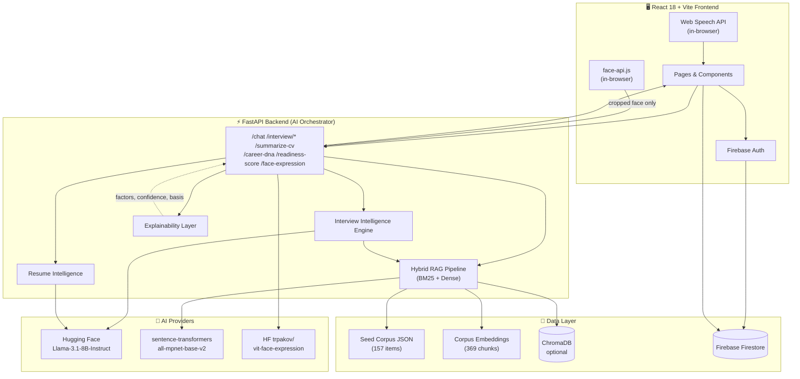

<div align="center">

# 🚀 CareerPath

### An Explainable AI Career Intelligence Engine

**Multimodal AI mock interviews · Hybrid RAG career advice · Explainable scoring · Real-time coaching**


</div>

---

## ✨ What Makes CareerPath Different

CareerPath is **not just another AI chatbot**. It's a full-stack career intelligence platform that combines retrieval-augmented generation, multimodal interview coaching, deterministic scoring, and an end-to-end **explainability layer** so candidates always know _why_ the AI said what it said.

|                                               |                                                                                                         |
| --------------------------------------------- | ------------------------------------------------------------------------------------------------------- |
| 🎙️ **Multimodal Mock Interview Intelligence** | Live webcam analysis + real-time speech metrics + RAG-grounded questions + rubric-based answer scoring. |
| 🔍 **Hybrid RAG (BM25 + Dense)**              | Llama-3.1-8B grounded in a 157-item curated career corpus with sentence-transformer embeddings.         |
| 🧠 **Explainable AI (XAI)**                   | Every score, every match, every recommendation ships with the factors that produced it. No black boxes. |
| 📄 **Resume Intelligence**                    | PDF → structured skills + tools + roles + LLM-augmented "hot skills" suggestions.                       |
| 📊 **Career DNA & Readiness**                 | Deterministic, transparent multi-factor scoring with reproducible outputs.                              |
| 🕸️ **Live Knowledge Graph**                   | Firestore-driven force-directed map of your skills → top job → recommended courses.                     |
| 🎯 **What-If Simulator**                      | Predict how acquiring a new skill would shift your readiness score, instantly and client-side.          |
| 🔔 **Real-Time Notifications**                | Firestore-backed onSnapshot stream with toast surfacing and per-thread chat history.                    |

---

## 🎙️ Flagship Feature — Mock Interview Intelligence Engine

The Mock Interview module is a **multimodal AI interview coach**, not a question-asking chatbot. It runs three pipelines in parallel — _language_, _voice_, and _vision_ — and fuses their signals into an explainable score.

### 🎬 Interview Generation (RAG-grounded)

- **Resume-aware questions** — your stored profile (skills, tools, preferred track, experience level) is injected into the prompt context.
- **Job-role-specific** — Frontend / Backend / DevOps / AI-ML / Communication tracks each pull a different slice of the corpus.
- **Difficulty-tiered** — junior / intermediate / advanced shape both the question and the reference rubric.
- **Adaptive follow-ups** — the last 8–10 questions for the same role/difficulty are _excluded_ from generation, and the same is enforced per session so the candidate never sees a repeat.
- **RAG-grounded** — every question is anchored to a hybrid BM25 + dense retrieval pass over the seed corpus before being handed to Llama-3.1-8B.

### 🎤 Voice Intelligence (Browser Web Speech API)

The browser streams the candidate's spoken answer into the transcription pipeline. The transcript is then analysed live:

| Metric                     | What it measures                                                             |
| -------------------------- | ---------------------------------------------------------------------------- |
| **Words per minute (WPM)** | Healthy zone 110–160; coaching fires for too slow / too fast.                |
| **Filler word count**      | Tracks `um`, `uh`, `like`, `you know`, `basically`, `actually`, `literally`. |
| **Pause seconds**          | Cumulative inter-utterance silence — high values trigger pacing tips.        |
| **Answer completeness**    | Word count vs. expected answer length for the question difficulty.           |
| **Response structure**     | Detects practical examples (`I built…`, `we used…`, `in my project…`).       |

Each metric maps to a **specific, actionable coaching card** with the current value and the target zone.

### 👁️ Real-Time Computer Vision Coaching

A lightweight, **privacy-respecting** vision pipeline runs locally in the browser:

- **In-browser face detection + 7-class expression scoring** via [`@vladmandic/face-api`](https://github.com/vladmandic/face-api) — models served from `/public/models` (no third-party CDN, no biometric upload).
- **Optional backend assist**: when a face is detected, only the **cropped region** is forwarded to the backend `/face-expression` endpoint, which proxies it to Hugging Face `trpakov/vit-face-expression` and blends the scores.
- **Per-user baseline calibration** — averages the first few frames to learn the candidate's _resting_ expression so coaching is calibrated, not generic.
- **Smoothing window** — 5-frame rolling average over ~15 seconds means a single misclassified frame can never derail the coaching.

Coaching tips that the engine actually emits (sampled, one rotating tip at a time, non-disruptive):

> 👁️ Move closer to the camera — face not detected  
> 🌬️ Take a breath — slow down and speak with intention  
> 🧘 Relax your jaw and brow — aim for an open, neutral face  
> ⬆️ Lift your chin slightly and maintain an upright posture  
> ✅ Great composure — keep this energy

### 📈 Behavioral Analysis (observation-based, not speculative)

The system reports only what it can _measure_:

- **Facial engagement** — distribution across the 7 expression classes, smoothed.
- **Presence score** — composite of frame-level confidence × non-negative expression rate (0–100).
- **Stress / nervousness rate** — % of frames classified as `angry / disgust / fear / sad`.
- **Delivery interpretation** — `Composed and confident` (<20%) / `Moderate nervousness` (20–40%) / `High stress` (≥40%).

> CareerPath deliberately **does not** claim emotion detection, lie detection, personality prediction, or hiring recommendations. Every behavioural signal corresponds to a measurable, reproducible model output.

### 📊 AI Feedback Report

When the session ends, the candidate receives an itemised report:

- **Interview Readiness Score** — aggregated from per-question rubric scores.
- **Per-question rubric breakdown** — `core_concepts (40)`, `technical_accuracy (30)`, `practical_example (20)`, `communication (10)`.
- **Concepts covered / concepts missing** — semantic gap analysis between your answer and the LLM-generated reference answer.
- **Voice coaching cards** — speaking pace, filler usage, pause patterns.
- **Expression coaching summary** — dominant expression, stress %, composure interpretation.
- **Personalised strengths and improvement areas** — extracted by the LLM from your transcript.
- **Action plan** — what to practise next, anchored to the rubric weaknesses.

Every score is **explainable**: hover any number and you see the factors that produced it.

### 🧮 How a Single Answer Is Scored (Deterministic Rubric)

The interview pipeline runs _two_ LLM calls and _one_ deterministic scorer per question:

1. **Question generation** — RAG context + role + difficulty → Llama-3.1-8B → exactly one question.
2. **Reference answer generation** _(background task, started immediately after the question is returned)_ — same context → Llama-3.1-8B → JSON `{ideal_answer, must_mention, bonus_points, red_flags, scoring_weights}`.
3. **Candidate submits answer** → `_semantic_gap_analysis()` compares answer ↔ reference → `_compute_rubric_score()` produces a deterministic 1–10 score.
4. **LLM evaluator** generates `feedback / strengths / improvements` — but the **numeric score is rubric-derived, not LLM-derived**, so it is reproducible and explainable.

This is why the same answer to the same question always produces the same score, but the prose feedback can adapt.

### 📚 Progress Tracking

Every completed session is persisted to Firestore `interviewHistory`:

- per-question journey (question, answer, score, rubric breakdown)
- voice metrics and expression distribution
- session total, average, and pass/fail flags
- timestamp and role/difficulty metadata

The history view lets you compare runs over time and verify measurable improvement.

---

## 🧠 Other AI Capabilities

### 💬 Hybrid RAG Career Chat

- **Hybrid retrieval** combines BM25 sparse + sentence-transformer dense (`all-mpnet-base-v2`) over a 157-item curated corpus (jobs · courses · advice · roadmaps).
- **Cosine reranking** + per-track filtering + adjustable retrieval alpha.
- **Template-composed answers** with `[S1]`, `[S2]` citations and a Sources panel.
- **Optional LLM generator** (`ENABLE_LLM_GENERATOR=true`) routes the same retrieved sources through Llama-3.1-8B for free-form prose answers.
- Per-user **threaded chat history** stored in Firestore `users/{uid}/chatThreads/{id}` with legacy single-doc migration.

### 📄 Resume / CV Intelligence

- PDF → text extraction (PyPDF2).
- Deterministic skill matching against a hand-tuned skills dictionary (180+ entries).
- **LLM-augmented structuring** merges parsed and inferred fields into `{keySkills, toolsTechnologies, rolesAndDomains}`.
- **Hot-skills suggestion** — Llama-3.1 evaluates the resume against current market signals and proposes 3–5 high-leverage skills to add.

### 🧬 Career DNA & Readiness Score

- Multi-dimensional radar (5 categories) plotting your skill mix against industry benchmarks.
- Weighted readiness score with **transparent factor breakdown** (skill match, profile completion, interview score, etc.).
- Every endpoint returns an **XAI envelope**: `{ value, basis, factors[], confidence }` — never a bare number.

### 🕸️ Knowledge Graph

- React Flow visualisation of `User → Skills → Top Job → Recommended Courses`.
- Live, Firestore-driven — pulls your actual stored skills and the curated `learningResources` collection.
- Animated, theme-aware (light + dark), with a minimap and zoom controls.

### 🔮 What-If Simulator

- Pure client-side prediction loop: pick hypothetical skills, see the readiness-score delta in real time.
- Calls `/career-dna` and `/readiness-score` with mutated profile payloads — no LLM round-trip, latency under 200 ms.

### 🏅 Verifiable Mindsparks Credential

- On-the-fly PDF generation (`jspdf`) of a "Mindsparks Badge" once the readiness threshold is met.
- Includes signed metadata (user id, score, issue date) and the Mindsparks brand mark.

### 🔔 Real-Time Notifications

- Firestore subcollection `users/{uid}/notifications` with `onSnapshot` subscription.
- Bell badge with unread count, today / earlier grouping, mark-read & dismiss, bulk clear.
- Toast on every new unread notification — no polling, no missed events.

---

## 🏗️ System Architecture



**Why this is honest:**

- ChromaDB is _optional_ — there's a flat-file fallback and the app runs without it.
- All face inference is in-browser by default; the backend only sees a face _crop_, never the full webcam frame.
- No biometric data is persisted server-side.

---

## 🛠️ Tech Stack

> Every entry below is actually in `package.json` / `requirements.txt`. Items not yet wired (e.g. MediaPipe, Whisper) are listed under [Roadmap](#-roadmap).

### Frontend

| Layer     | Technology                                                       |
| --------- | ---------------------------------------------------------------- |
| Framework | React 18 · Vite 6 · React Router 6                               |
| Styling   | Tailwind CSS 3 · custom CSS-variable theme tokens (light + dark) |
| Motion    | Framer Motion · GSAP-style animations (lucide-react icons)       |
| Charts    | Chart.js + react-chartjs-2 (radar, line)                         |
| Graphs    | `@xyflow/react` (knowledge graph)                                |
| Vision    | `@vladmandic/face-api` (in-browser face detection + expression)  |
| Speech    | Browser Web Speech API (no server upload)                        |
| PDF       | `@react-pdf/renderer` · `jspdf` (credentials)                    |
| State     | React Context (`Auth`, `Theme`, `Notifications`)                 |
| Auth      | Firebase Auth (email + Google)                                   |
| Storage   | Firestore (real-time, `onSnapshot`)                              |

### Backend

| Layer            | Technology                                                                   |
| ---------------- | ---------------------------------------------------------------------------- |
| Framework        | FastAPI 0.121 · Uvicorn · Pydantic v2                                        |
| Language         | Python 3.11+                                                                 |
| HTTP             | `httpx==0.28.1` (pooled async, keep-alive)                                   |
| Document parsing | PyPDF2 · python-multipart                                                    |
| Retrieval        | Hand-rolled BM25 + cosine reranking · ChromaDB (`chromadb-client`, optional) |
| Embeddings       | `sentence-transformers/all-mpnet-base-v2` (local or HF inference)            |
| LLM              | Hugging Face `meta-llama/Llama-3.1-8B-Instruct` via router                   |
| Vision proxy     | HF `trpakov/vit-face-expression` (crop-only, server-side)                    |
| Reranking        | Optional cross-encoder (`ENABLE_RERANKER=true`)                              |
| ML deps          | `torch==2.12.1` (CPU build) · `transformers==5.12.1` · `accelerate`          |

### Infrastructure

|                     |                                                             |
| ------------------- | ----------------------------------------------------------- |
| Frontend hosting    | Vercel (or any static host serving `frontend/build/`)       |
| Backend hosting     | Hugging Face Spaces (Dockerfile included) · any Docker host |
| Local orchestration | `docker compose up` (frontend + backend + ChromaDB)         |

---

## 🔑 Backend API

| Endpoint               | Method | Purpose                                                          |
| ---------------------- | ------ | ---------------------------------------------------------------- |
| `/`                    | GET    | API liveness check                                               |
| `/health/dependencies` | GET    | Per-dependency readiness report (corpus, embeddings, HF, Chroma) |
| `/docs`                | GET    | Auto-generated Swagger UI                                        |
| `/chat`                | POST   | Hybrid-RAG career chat (with optional LLM generator)             |
| `/summarize-cv`        | POST   | Parse + structure a PDF CV with LLM augmentation                 |
| `/roadmap`             | POST   | Generate a personalised learning roadmap                         |
| `/interview/question`  | POST   | Generate one RAG-grounded interview question                     |
| `/interview/evaluate`  | POST   | Rubric-score an interview answer + LLM feedback                  |
| `/career-dna`          | POST   | 5-category Career DNA score with factor breakdown                |
| `/readiness-score`     | POST   | Weighted readiness score with explainability envelope            |
| `/explain-match`       | POST   | Explain a candidate ↔ job match                                  |
| `/face-expression`     | POST   | Proxy a cropped face frame to HF ViT and return distribution     |

Legacy aliases are preserved for older clients: `/generate-interview-question`, `/evaluate-interview-answer`, `/analyze-expression`.

### Mock-Interview Response Shape (excerpt)

`POST /interview/evaluate` returns the _deterministic_ rubric plus the LLM prose:

```json
{
  "score": 7,
  "feedback": "Solid answer; good practical example. Tighten the discussion of trade-offs.",
  "strengths": [
    "Concrete project example",
    "Correctly framed REST statelessness"
  ],
  "improvements": ["Mention HTTP idempotency", "Discuss caching trade-offs"],
  "concepts_covered": ["statelessness", "resource-based URLs"],
  "concepts_missing": ["idempotency", "cacheability"],
  "coverage_pct": 60,
  "score_breakdown": {
    "core_concepts": 24,
    "technical_accuracy": 22,
    "practical_example": 18,
    "communication": 8
  },
  "rag_grounded": true,
  "skills_tested": ["REST APIs", "HTTP", "FastAPI"]
}
```

The numeric score is reproducible. The prose adapts.

---

## 🚀 Local Setup

### Option A — Docker Compose (recommended)

```bash
git clone https://github.com/Tayebbb/IDC-HACKATHON.git
cd IDC-HACKATHON
docker compose up -d --build
```

This brings up:

- **Frontend** — http://localhost:18080 (nginx serving the Vite build)
- **Backend** — http://localhost:8010 (FastAPI + RAG)
- **ChromaDB** — http://localhost:8002 (optional vector store)

Create `.env` next to `docker-compose.yml` to unlock LLM-backed routes:

```env
HF_TOKEN=hf_xxxxxxxxxxxxxxxxxxxxxxxxx
```

Without an HF token the app degrades gracefully — `/chat` still works via local embeddings; `/interview/*`, `/roadmap`, and the LLM-augmented CV parse will return 502 with a clear message.

### Option B — Native dev mode

#### Backend

```bash
cd backend
python -m venv .venv

# Windows PowerShell
.\.venv\Scripts\Activate.ps1
# macOS / Linux
source .venv/bin/activate

pip install -r requirements.txt
uvicorn main:app --reload --port 8000
```

Open Swagger UI: http://localhost:8000/docs

#### Frontend

```bash
cd frontend
npm install
npm run dev
```

Vite dev server: http://localhost:5173

---

## 🔐 Environment Variables

### `backend/.env`

| Variable                      | Purpose                                         | Default                              |
| ----------------------------- | ----------------------------------------------- | ------------------------------------ |
| `HF_TOKEN`                    | Hugging Face Inference token (LLM + ViT)        | — (LLM routes return 502 if missing) |
| `USE_LOCAL_EMBEDDINGS`        | Prefer local sentence-transformers over HF API  | `false` (Docker default `true`)      |
| `ENABLE_RERANKER`             | Enable cross-encoder reranking on RAG           | `false`                              |
| `ENABLE_LLM_GENERATOR`        | Free-form LLM answers in `/chat` (vs. template) | `false`                              |
| `CHROMA_HOST` / `CHROMA_PORT` | ChromaDB connection                             | falls back to flat-file              |
| `CORS_ORIGINS`                | Comma-separated allowlist                       | `*`                                  |

### `frontend/.env`

| Variable          | Purpose                                                |
| ----------------- | ------------------------------------------------------ |
| `VITE_API_URL`    | Backend base URL (defaults to `http://localhost:8000`) |
| `VITE_FIREBASE_*` | Firebase project keys (auth + Firestore)               |

---

## 🗂️ Project Structure

```text
.
├── frontend/                  React 18 + Vite app
│   ├── src/
│   │   ├── components/        Reusable UI + branding (AIMark, ReasoningCard, …)
│   │   │   └── FaceExpressionOverlay.jsx    in-browser face-api pipeline
│   │   ├── contexts/          Auth · Theme · Notifications providers
│   │   ├── pages/             Dashboard · MockInterview · Chatassistance · …
│   │   ├── services/          notificationsService · firestoreService
│   │   ├── utils/             explainability · matchScore · getLearningSuggestions
│   │   └── config.js          Base API URL
│   ├── public/
│   │   ├── code-front/        Event branding assets (lowercase, no spaces)
│   │   └── models/            face-api.js weights (~520 KB, co-deployed)
│   ├── vite.config.js         Tuned chunk splitting (faceapi, pdf, charts split)
│   └── package.json
│
├── backend/                   FastAPI service (single-file orchestrator)
│   ├── main.py                Routes · RAG · Interview engine · Explainability
│   ├── data/
│   │   ├── seed_corpus.json       Jobs · courses · advice · roadmaps (157 items)
│   │   ├── corpus_embeddings.json All-mpnet embeddings (369 chunks)
│   │   ├── career_advice.json
│   │   └── skill_roadmaps.json
│   ├── scripts/               Smoke tests · index builders
│   ├── Dockerfile
│   └── requirements.txt
│
├── careerpath-backend/        HF Spaces deployment mirror (gitlink)
├── docker-compose.yml         Frontend + backend + ChromaDB
├── vercel.json                Vite output → `frontend/build`
└── README.md
```

---

## 🔬 Explainability Layer (XAI)

Every AI surface in CareerPath answers four questions:

1. **Why was this recommendation made?** — sourced via the `basis` field.
2. **What evidence supports it?** — listed in `factors[]` with `signal_type` and `value`.
3. **Which skills influenced the score?** — exposed via `skills_tested` / `matched_skills` / `missing_skills`.
4. **How can the user improve?** — surfaced in `improvements[]` and the action plan.

The frontend renders these through a dedicated `<ReasoningCard>` component so users can audit any prediction without leaving the page. There are no opaque black-box outputs.

Example envelope from `/readiness-score`:

```json
{
  "value": 78,
  "confidence": "High",
  "basis": "Composite of skill_match (45), profile_completion (20), interview_score (13)",
  "factors": [
    {
      "label": "Skill match vs. target role",
      "signal_type": "skill_match",
      "value": 0.71,
      "positive": true
    },
    {
      "label": "Profile completion",
      "signal_type": "profile",
      "value": 0.85,
      "positive": true
    },
    {
      "label": "Mock interview avg",
      "signal_type": "interview",
      "value": 7.4,
      "positive": true
    }
  ]
}
```

---

## 🏎️ Performance Notes

The backend pipeline ships with deliberate latency engineering:

- **Pooled `httpx.AsyncClient`** for all HF chat calls — keep-alive saves the TCP + TLS handshake (~50–200 ms per call) and never blocks a worker thread.
- **Background reference generation** — `/interview/question` returns after one LLM call and the rubric reference answer is generated asynchronously; `/interview/evaluate` awaits the in-flight task only if needed (≈2× faster TTFB).
- **Session-scoped RAG cache** — `(role, difficulty, track, skills_signature)` → cached BM25+dense pass for 10 min, so the same retrieval isn't recomputed for every question.
- **Frontend chunk splitting** — heavy libraries (`face-api`, `pdf`, `charts`, `react-flow`) live in dedicated lazy-loaded chunks; the Profile page went from a 1.5 MB chunk to 19.5 KB.
- **terser** with `drop_console: true` and `passes: 2` in production builds.

---

## 🧭 Roadmap

These are explicitly **not implemented yet** — listed honestly:

- 🎯 **MediaPipe pose / hand landmarks** for true posture and gesture coaching.
- 🗣️ **Whisper-based STT** as a server-side alternative to the Web Speech API (better accuracy on non-English accents).
- 📈 **Scikit-learn classifiers** for trajectory clustering (k-means over skill vectors, logistic regression for offer-likelihood).
- 🌐 **Gemini fallback** when the HF router is rate-limited.
- 🧪 **TypeScript migration** of the frontend (currently JS + JSX).
- 📨 **Email / push notifications** beyond the in-app bell.

---

## 🚀 Deployment

### Frontend (Vercel)

`vercel.json` already points the build to `frontend/build`:

```json
{
  "rootDirectory": "frontend",
  "buildCommand": "npm run build",
  "outputDirectory": "build",
  "framework": "vite",
  "rewrites": [{ "source": "/(.*)", "destination": "/index.html" }]
}
```

Set `VITE_API_URL` and the Firebase keys in Vercel project settings.

### Backend (Hugging Face Spaces — Docker)

The `careerpath-backend/` directory is a Docker-ready mirror for HF Spaces.

Required Space secret:

```text
HF_TOKEN=<hf_xxx>
```

Recommended variables for CPU Basic:

```text
USE_LOCAL_EMBEDDINGS=false
ENABLE_RERANKER=false
ENABLE_LLM_GENERATOR=false
```

`GET /health/dependencies` will report `overall: "ok" | "degraded" | "critical"` so external uptime checks have a clear signal.

---

## 🛡️ Privacy & Trust

- **Webcam frames never leave the browser whole** — face-api.js runs locally; only the detected face _crop_ is forwarded if the optional backend assist is on.
- **No biometric storage** — expression vectors are computed in-flight; only the rolling presence score is persisted in `interviewHistory`.
- **Tokens are server-side only** — `HF_TOKEN` lives in `backend/.env`; the frontend never sees it.
- **Firebase keys** are non-sensitive (web app pattern); access is gated by Firestore security rules.
- **CORS** is env-driven (`CORS_ORIGINS`) — wildcard for dev, allowlist for production.

---

## 🧪 Build & Smoke Checks

```bash
# Backend syntax check
cd backend && python -c "import ast; ast.parse(open('main.py', encoding='utf-8').read()); print('OK')"

# Frontend production build
cd frontend && npm run build
# → output: frontend/build/

# Backend smoke (Hugging Face Space)
python scripts/test_connectivity.py
python scripts/smoke_new_endpoints.py
```

---

## 🤝 Contributing

This is a hackathon prototype, but the codebase is structured for continuation:

- Backend logic lives in **one file (`backend/main.py`)** for easy auditing — split into modules when it grows past ~3 k LOC.
- Frontend follows a flat `pages/` + `components/` + `contexts/` layout.
- All AI surfaces share the same explainability envelope shape — when adding a new endpoint, follow the `{ value, factors[], basis, confidence }` pattern.

---

## 📜 License

Built for the **IDC × CodeFront Challenge × Mindsparks 26 Hackathon** by the CareerPath team at AUST IDC.

---

<div align="center">

_"Explainable, multimodal, and grounded — career intelligence that earns your trust."_

</div>
